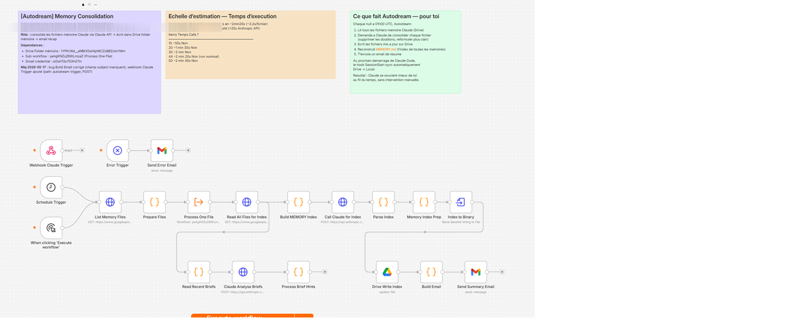

# Autodream — Nightly memory consolidation for Claude Code

[](https://github.com/WoodyJ2H/Autodream/stargazers)

> If this saves you time, a ⭐ star helps others find it.

> Open-source n8n workflow that makes Claude Code memory survive over time.
> Every night, Autodream reviews your memory files, consolidates them via Claude Sonnet, and writes them back to Google Drive — so each new session starts with cleaner, deduplicated context.

> **Looking for clean handoffs between sessions?** Check out the companion project
> [**claude-session-transfer**](https://github.com/WoodyJ2H/claude-session-transfer) — a magic-keyword (`TRANSFER`) skill that generates a self-contained markdown brief so a new session resumes instantly without re-explanation.



---

## What it does

Every night at 3am, Autodream:
1. Lists all `.md` memory files in your Google Drive "Claude Memory" folder
2. Sends each file to Claude Sonnet for consolidation (removes redundancy, fixes contradictions, improves clarity)
3. Rewrites the file on Drive **only if changes were made**
4. Sends you an email summary (modified / unchanged files)

---

## Architecture

```
[Schedule 3am] → [List Drive files] → [Process One File x N]
  → [Read file from Drive]
  → [Claude Sonnet consolidation]
  → [Write back to Drive if changed]
→ [Email summary]
[Error Trigger] → [Error email]
```

**Two workflows:**
- `autodream-memory-consolidation.json` — Main orchestrator
- `autodream-process-one-file.json` — Sub-workflow (called once per file)

---

## Requirements

- n8n instance (self-hosted or cloud)
- Google Drive OAuth2 credential
- Anthropic API credential
- Gmail OAuth2 credential
- A Google Drive folder containing your Claude Code memory `.md` files

---

## Setup

### 1. Import the workflows

Import both JSON files into your n8n instance in this order:
1. `autodream-process-one-file.json` (sub-workflow — import first to get its ID)
2. `autodream-memory-consolidation.json` (main workflow)

### 2. Configure the main workflow

In `autodream-memory-consolidation.json`, update:

| Node | Field | Value |
|---|---|---|
| List Memory Files | URL | Replace `YOUR_GOOGLE_DRIVE_FOLDER_ID` with your Drive folder ID |
| Process One File | Workflow ID | Replace `YOUR_SUBWORKFLOW_ID` with the ID of the imported sub-workflow |
| Send Summary Email | Send To | Replace `YOUR_EMAIL@gmail.com` with your email |
| Send Error Email | Send To | Replace `YOUR_EMAIL@gmail.com` with your email |

### 3. Set credentials

On every HTTP Request node that calls Google Drive or Gmail, select your OAuth2 credentials.
On the Call Claude node, select your Anthropic API credential.

### 4. Activate

Activate the sub-workflow first, then the main workflow.

---

## Bug fix — v1.1 (2026-04-26)

**Critical fix:** The `Write File` node in the sub-workflow had `specifyBody: raw` configured but **no body field set**. This caused Drive to receive an empty body, silently overwriting consolidated files with blank content.

Fixed: `body` is now correctly set to `={{ $json.newContent }}` (the consolidated content returned by Claude).

If you imported a previous version, open the sub-workflow, find the **Write File** node, and set the body field to `={{ $json.newContent }}`.

---

## Sync back to local (recommended)

Autodream writes consolidated files to Drive, but Claude Code reads from your local `~/.claude/projects/.../memory/` directory. To close the loop, sync Drive back to local at each session start.

Create a PowerShell script and a `SessionStart` hook in `~/.claude/settings.json`:

```json
{
  "hooks": {
    "SessionStart": [{
      "hooks": [{
        "type": "command",
        "command": "pwsh -NonInteractive -ExecutionPolicy Bypass -File \"path/to/sync-memory-from-drive.ps1\"",
        "timeout": 30,
        "statusMessage": "Syncing memory from Drive..."
      }]
    }]
  }
}
```

---

## Schedule

Default: `0 0 3 * * *` (3am daily). Modify the Schedule Trigger node to change the frequency.

---

## Error handling

Both workflows have an Error Trigger node that sends an email alert on failure. Configure the `errorWorkflow` setting in n8n to point to a dedicated error handler if needed.

---

## Related

- [**claude-session-transfer**](https://github.com/WoodyJ2H/claude-session-transfer) — Persistent session handoff via magic keyword `TRANSFER`. Saves a self-contained markdown brief so a new Claude Code session resumes instantly with full context.

---

## License

MIT
